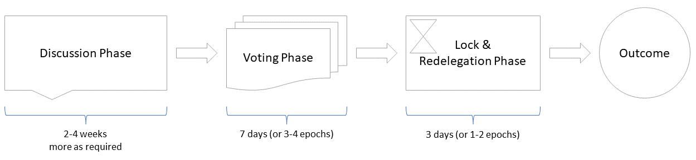

# Lifecycle of a Proposal

The specific parameters governing the lifecycle of a proposal should be tunable, and their starting value are up for debate. Below is a graphic showcasing one possible such lifecycle with suggested periods for illustrative purposes:

<figure><figcaption></figcaption></figure>

Currently two existing forums exist in which proposals of sorts are being discussed:

* SIMDs
* sRFCs

The discussions there should likely connect to proposal discussions in some way. Perhaps they can remain in those forums as the primary venue of debate and when they are ready for proposal discussion stage a discussion is created in the governance proposal forum which links to the prior conversations which would be more focused on technical and implementation detail.

Some proposals might focus on tuning on-chain parameters, such as the lock & redelegation phase, base fees etc, where the primary venue of debate can be the governance forum.
